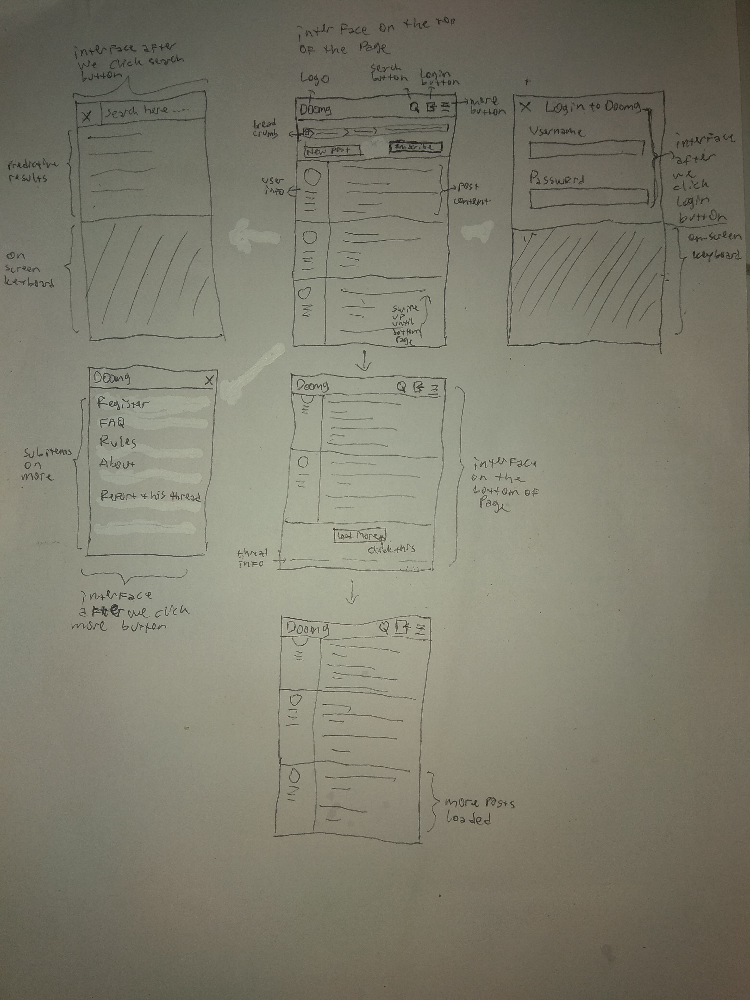
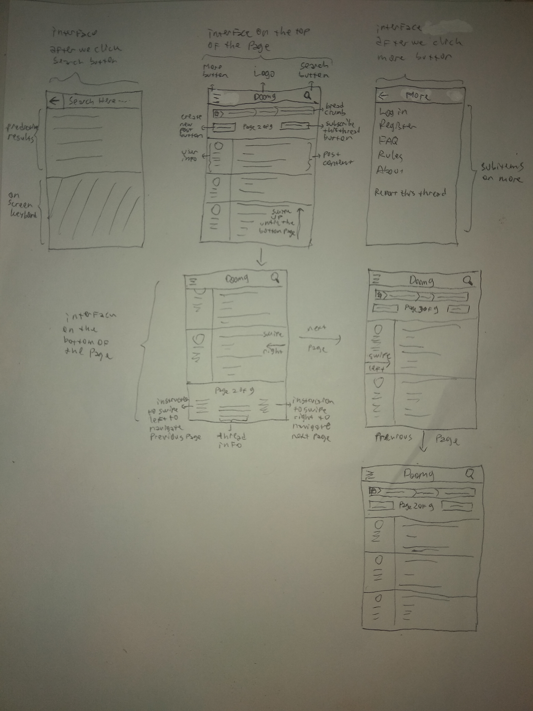
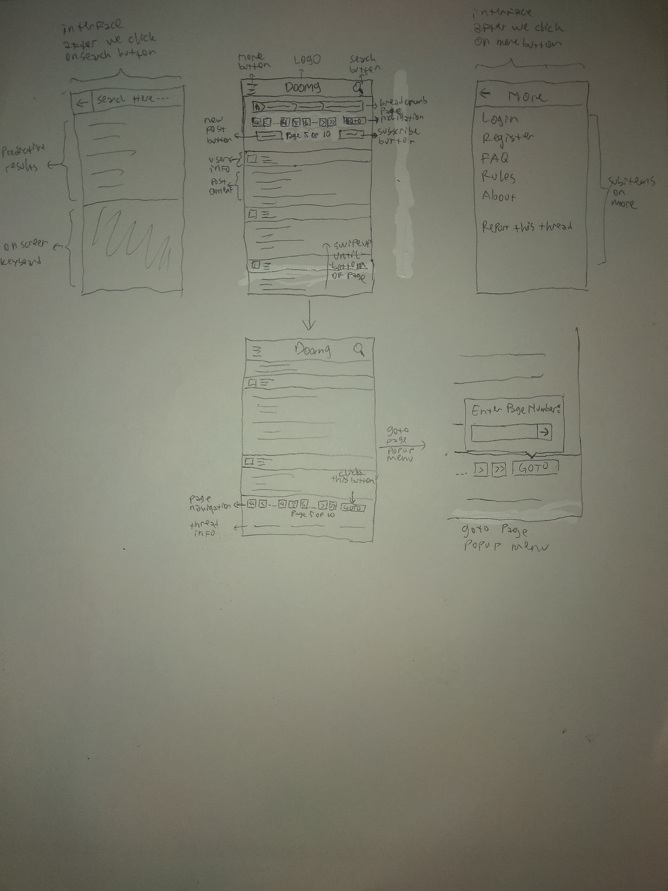
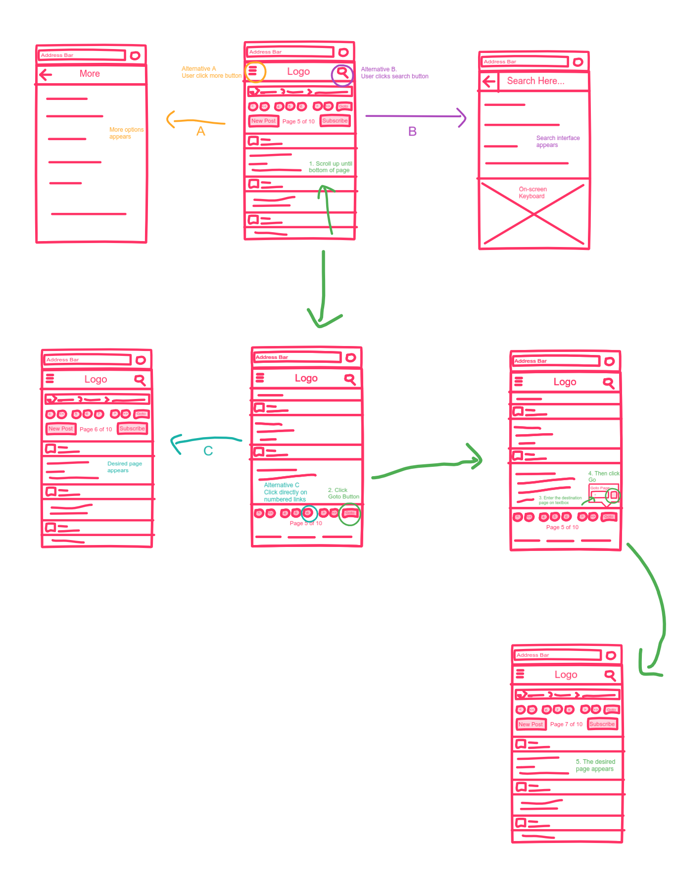

# Sketching and Prototyping
Using the information in the results of Assignment 1 for what is good and bad about the UI for designed tasks, we are going to make **Sketches** and **Prototypes**. These sketches and prototypes will lead to better design in Assignment 3. The prototypes will be then tested through a usability evaluation followed by design revision in Assignment 4.

## Part A: Sketches
Sketch at least **3 (three)** different UIs for the functions you are targeting. These three interfaces should be _dramatically different_ in terms of design directions. For example, they can be with different organizations of what functions on each screen or using a different layout of the icons, widgets, and menus on the screens. If you want, you can also incorporate non-on-screen UIs: physical buttons, gestures through motion sensors, etc.

You need **not** sketch the whole interface. It is not necessary for the sketches to have every function or every function in detail, but there should be enough to show off your general idea. **Be creative!** Draw your idea and label a few of the widgets so we can tell your intent. The goal is to have at least 3 good UIs in ~~*interesting*~~ ways. Sketches should be done on paper with pens and/or pencils (do not use a computer).

### 1. Scan/Photo of Sketches

#### Sketch of Original Version

#### First Proposed Version

#### Second Proposed Version

#### Third Proposed Version

### 2. Version Differences

There are only some minor differences between proposed version. Mostly just layout differences.

#### Description on Original Version

The problem is the site doesn't have a "mobile view" so the user have to zoom-in and out while reading. Although on some "smarter" browser, they enlarge the text on some place that considered vital. But the page navigation still hard to tap because the nature of finger that is fatter than mouse click.

#### Differences on First Proposed Version

A lot of change on layout. Now we implement the proper mobile layout. There is no pagination in this version. More posts will loaded if the user reached the end of the page and click "Load More" button.

#### Differences on Second Proposed Version

Similar with the first proposed layout, but still use the pagination. User just to swipe left or right to navigate between page.

#### Differences on Third Proposed Version

Similar with second proposed layout, but this is more conventional. Page navigation placed on the top and bottom of the page with an option to "go to" a page directly. Also different placement of user info.

### 3. Selected Sketch

Personally, I prefer the **third proposed version** because it's relatively lightweight especially when loading a thread with many posts (_versus first version_) because the first version will load more and more posts as we clicked "Load More" button. And less evidence of "accidentally switched page" while scrolling (_versus second version_) because sometimes our finger can be slipped accidentally.

### 4. Design Rationale

Nowadays, a lot of people are using their smartphone to browse the internet like looking for information, doing some works, including communicating with other people who have same interest through forum. The absence of "mobile view" on a forum website is **considered ~~harmful~~ annoying**. Because, it's very awful to zoom-in and out just to read every post on it and navigate through pages.

## Part B: Assumptions
### 1. Hardware

We're specifically address this design to mobile users. Overall the we assume that the user will use these kind of hardware:
* Smartphone (both iOS or Android).
* Screen size: Between 4" to 6.5".
* Screen resolution: 480 x 854 to 2160 x 3840 (This part doesn't affect too much, physical screen size affects more).
* Able to run browser. We assume it has:
    * Dual core ARM processor
    * 1 GB of RAM
* Using touchscreen.

### 2. Users

* Have smartphone with browser (either Android or iOS).
* Familiar with the topic of the forum (Multimedia, Audio/Video Codec or CD/DVD Ripping).
* Between 13 to 65 years old.

## Part C: Prototypes

### InVision Freehand Sketch

Here is the InVision Freehand Sketch version of selected alternative solution.

### InVision Prototype Project

The prototype can be accessed [here](https://invis.io/DAR87DP7H8P#/354582252_Screenshot_At_2019-03-27_13-58-14).